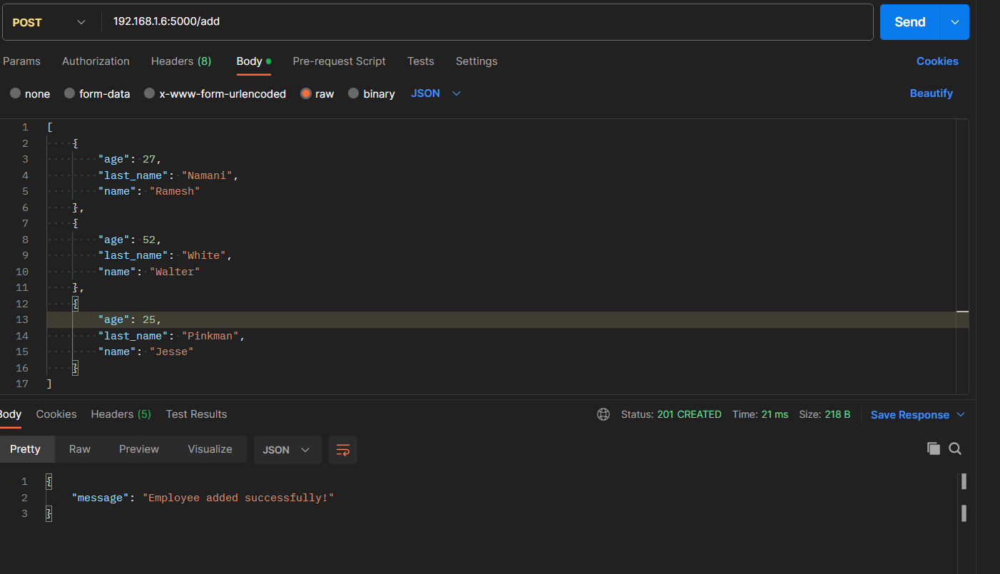
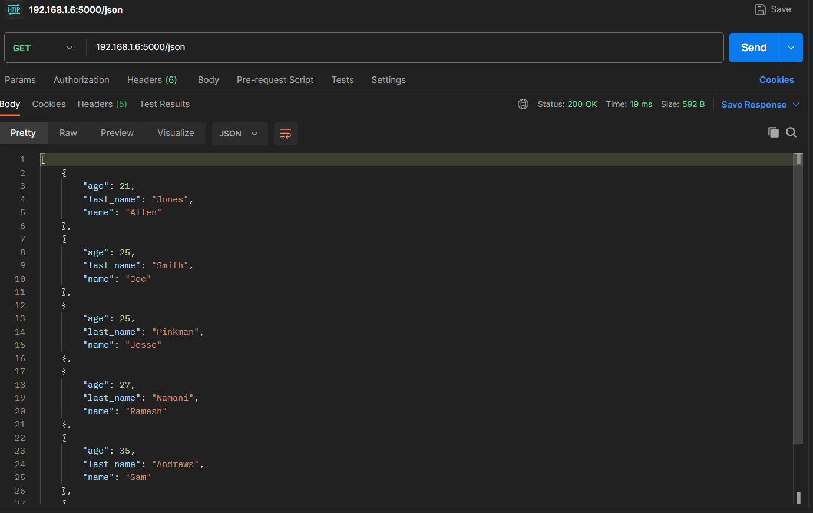
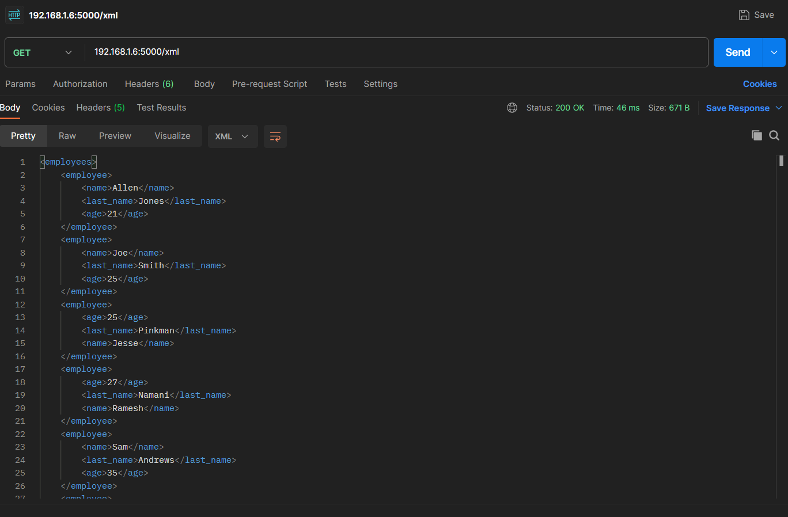

# Exercise-2

The code in this repository exposes the following endpoints on port 5000

**/add   - add an entry to the existing list json of employess:** 
#### Request-type: POST, Body: List of JSON



**/json   - Returns the list of employees as a JSON string** 
#### Request-type: GET



**/xml    - Returns list of employees in XML format** 
#### Request-type: GET




### main.py

**Import Statements**

The code starts by importing the necessary modules, including Flask for creating the web application, request for handling HTTP requests, jsonify for creating JSON responses, Response for creating HTTP responses, Element and ElementTree from xml.etree.ElementTree for generating XML responses, and itemgetter for sorting the list of employees.

**Flask Application Setup:**

An instance of the Flask application is created with app = Flask(__name__).
Sample Employee Data:

A sample list of employee data (employees) is provided as a list of dictionaries. Each dictionary represents an employee with attributes such as name, last name, and age.

**/add Endpoint:**

The /add endpoint is defined with the @app.route('/add', methods=['POST']) decorator. It allows you to add one or more employees to the list using a POST request.
It expects a JSON object containing employee data in the request body.
If valid JSON data is received, it extends the employees list with the new employee(s) and returns a success message.
If the data is invalid or missing, it returns an error message with a 400 Bad Request status code.

**/json Endpoint:**

The /json endpoint is defined with the @app.route('/json', methods=['GET']) decorator. It allows you to retrieve the list of employees in JSON format using a GET request.
It sorts the list of employees by age and returns the sorted list as a JSON response.

**/xml Endpoint:**

The /xml endpoint is defined with the @app.route('/xml', methods=['GET']) decorator. It allows you to retrieve the list of employees in XML format using a GET request.
It sorts the list of employees by age and constructs an XML response containing employee data.

```python
if __name__ == "__main__":
    app.run(host='0.0.0.0', port=5000, debug=True)
```

This block ensures that the Flask app runs only when the script is executed directly (not when imported as a module).
The app is configured to run on 0.0.0.0 (accessible from any IP address) and port 5000 with debugging enabled (debug=True).